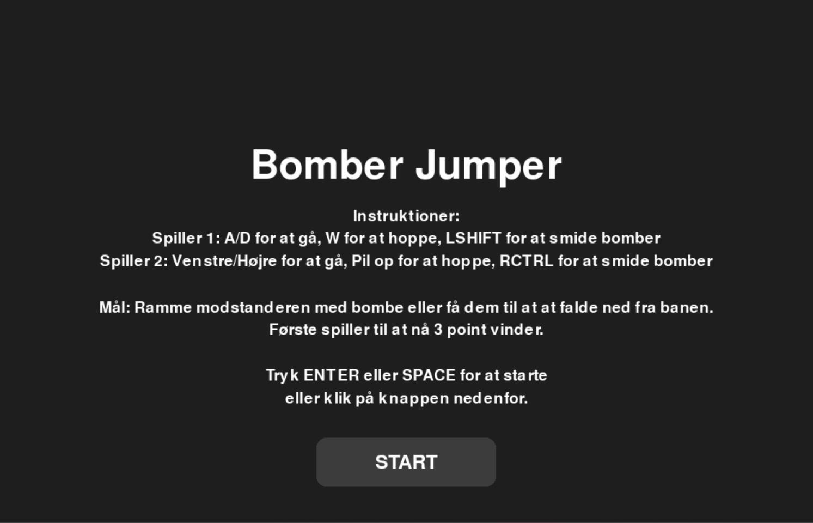
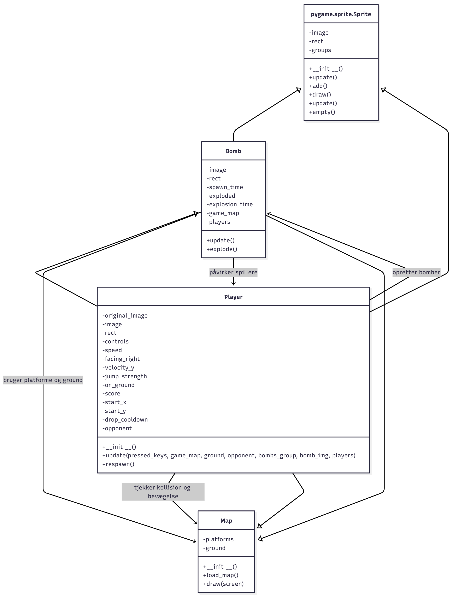
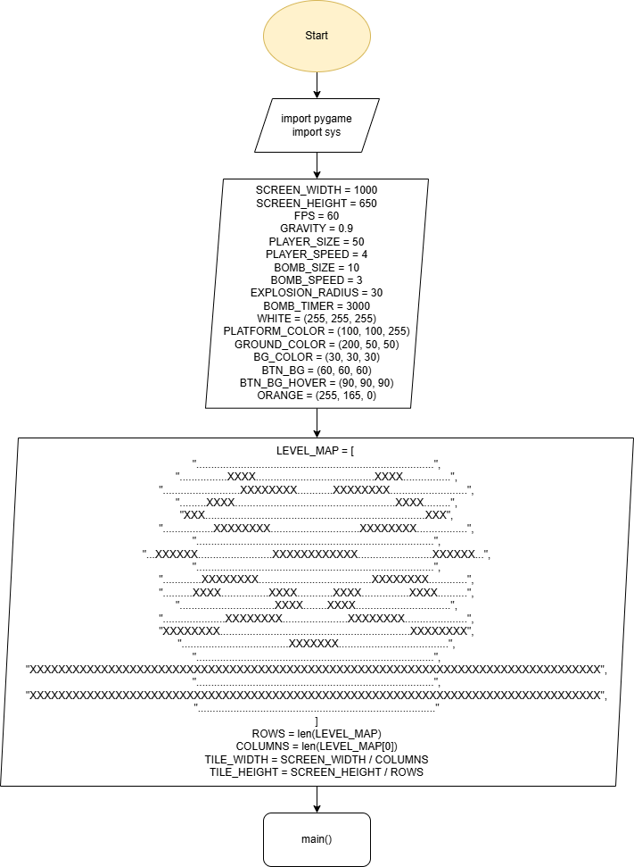

 
 

Dette er et platformspil for to spillere, bygget med Pygame. Spillerne konkurrerer om at undgå at falde ned på jorden samt sprænge hinanden og platformene i luften. Hver gang en spiller falder, får modstanderen 1 point. Det er først til 3 point. Spillet indeholder Bomber, PowerUps (WIP), Character selection menu (WIP) og Musik (WIP).

Krav til at køre spillet:
Python,
Pygame-biblioteket,
sørg for at du har filerne til billederne Boneca Ambalabu.png og Frigo Camelo.png i samme mappe som koden.

Player kontrol:
Spiller 1: A/D for at gå til venstre og højre, W for at hoppe, LSHIFT for at smide bomber.
Spiller 2: Venstre/Højre pil for at gå vesntre og højre, pil op for at hoppe, RCTRL for at smide bomber.

Spillerne starter på hver sin side af skærmen. Brug tasterne hop og bevægelse til at undgå at falde ned. Hvis en spiller rammer jorden eller en bombe, får modstanderen 1 point. Point vises øverst på skærmen.

For at starte så tryk "Run" på "Spillet.py" 

Link til Trello: https://trello.com/b/pA3y1TkX/objektorienteret-spil 

Klassediagrammer:

 

Flowcharts over programmet:

 

.png) 
