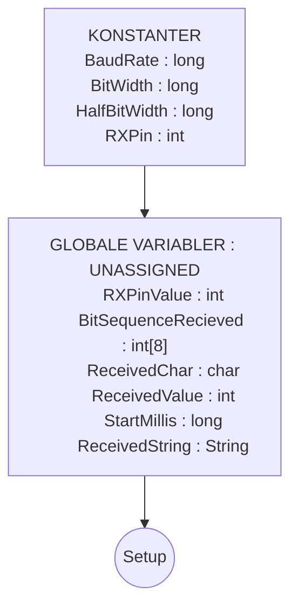
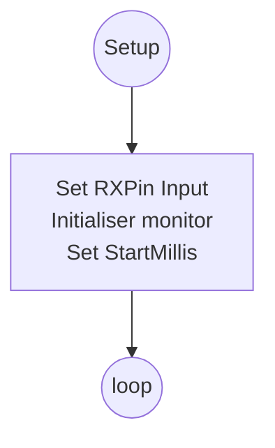
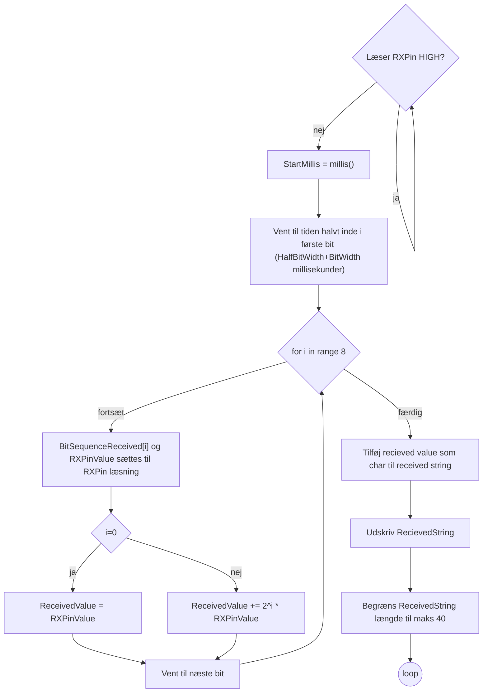

# robotTeknologi

## MICHAELS KODE TIL MODTAGER

```mermaid
flowchart TD
	a["KONSTANTER
	BaudRate : long
	BitWidth : long
	HalfBitWidth : long
	RXPin : int"]-->b
	
	b["GLOBALE VARIABLER : UNASSIGNED
	RXPinValue : int
	BitSequenceRecieved : int[8]
	ReceivedChar : char
	ReceivedValue : int
	StartMillis : long
	ReceivedString : String"]-->c((Setup))
	
```

```mermaid
flowchart TD
	a((Setup))-->b
	b["Set RXPin Input
	Initialiser monitor
	Set StartMillis"]-->c
	c((loop))
```

```mermaid
flowchart TD
	z((loop))
	a{"Læser RXPin HIGH?"}--"ja"-->a
	a--"nej"-->b["StartMillis = millis()"]
	b-->c["Vent til tiden halvt inde i første bit (HalfBitWidth+BitWidth millisekunder)"]
	c-->d{for i in range 8}
	d--fortsæt-->e["BitSequenceReceived[i] og RXPinValue sættes til RXPin læsning"]
	e-->f{"i=0"}
	f--ja-->fa["ReceivedValue = RXPinValue"]
	f--nej-->fb["ReceivedValue += 2^i * RXPinValue"]
	fa-->g
	fb-->g
	g["Vent til næste bit"]-->d
	d--færdig-->h["Tilføj recieved value som char til received string"]
	h-->i["Udskriv RecievedString"]
	i-->j["Begræns ReceivedString længde til maks 40"]
	j-->z
```
